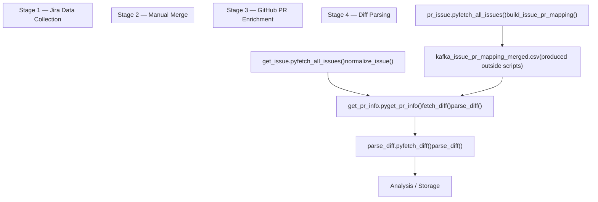
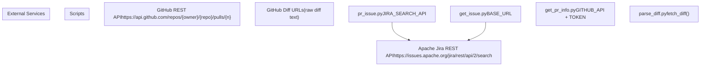

# Overview

> **Relevant source files**
> * [README.md](https://github.com/hreyulog/pr_issue_crawl/blob/e4700b21/README.md)
> * [get_issue.py](https://github.com/hreyulog/pr_issue_crawl/blob/e4700b21/get_issue.py)
> * [get_pr_info.py](https://github.com/hreyulog/pr_issue_crawl/blob/e4700b21/get_pr_info.py)
> * [parse_diff.py](https://github.com/hreyulog/pr_issue_crawl/blob/e4700b21/parse_diff.py)
> * [pr_issue.py](https://github.com/hreyulog/pr_issue_crawl/blob/e4700b21/pr_issue.py)

This page introduces the `pr_issue_crawl` repository: what it does, why it exists, and the role each script plays. It is scoped to the high-level picture only. For a detailed walkthrough of the pipeline's data flow and file artifacts, see [Pipeline and Data Flow](/hreyulog/pr_issue_crawl/1.1-pipeline-and-data-flow) and [File Artifacts Reference](/hreyulog/pr_issue_crawl/1.2-file-artifacts-reference). For per-script documentation, see [Jira Data Collection](/hreyulog/pr_issue_crawl/2-jira-data-collection) and [GitHub PR Enrichment](/hreyulog/pr_issue_crawl/3-github-pr-enrichment).

---

## Purpose

`pr_issue_crawl` is a four-script data collection pipeline that links Apache Kafka Jira issues to their corresponding GitHub pull requests and extracts the raw code diffs from those PRs. The resulting dataset associates each Jira issue (`key`, `summary`, `status`, `priority`, etc.) with the full diff content of every PR that references it.

The target data source is the Apache Kafka project on the public [Apache Jira instance](https://issues.apache.org/jira) and the [apache/kafka](https://github.com/hreyulog/pr_issue_crawl/blob/e4700b21/apache/kafka)

 GitHub repository. The pipeline is designed to be run once sequentially, producing a series of intermediate file artifacts that feed into the next stage.

---

## Scripts at a Glance

| Script | Stage | Primary Role | Key Output |
| --- | --- | --- | --- |
| `pr_issue.py` | 1 | Query Jira; extract GitHub PR URLs from issue descriptions and comments | `kafka_issue_pr_mapping.csv` |
| `get_issue.py` | 1 | Query Jira; fetch and normalize issue metadata fields | `kafka_jira_issues.csv` |
| `get_pr_info.py` | 3 | Call GitHub API for PR metadata; fetch raw diff per PR | `pr_info.jsonl` |
| `parse_diff.py` | 4 | Re-fetch diffs from `pr_info.json`; parse per-file added/deleted counts | `issues_with_diff.json` |

> **Stage 2** is a manual merge step performed outside any script. The output of `pr_issue.py` (`kafka_issue_pr_mapping.csv`) must be manually merged or filtered to produce `kafka_issue_pr_mapping_merged.csv` before Stage 3 can run.

Sources: [pr_issue.py L1-L146](https://github.com/hreyulog/pr_issue_crawl/blob/e4700b21/pr_issue.py#L1-L146)

 [get_issue.py L1-L106](https://github.com/hreyulog/pr_issue_crawl/blob/e4700b21/get_issue.py#L1-L106)

 [get_pr_info.py L1-L197](https://github.com/hreyulog/pr_issue_crawl/blob/e4700b21/get_pr_info.py#L1-L197)

 [parse_diff.py L1-L147](https://github.com/hreyulog/pr_issue_crawl/blob/e4700b21/parse_diff.py#L1-L147)

---

## End-to-End Pipeline

**Diagram: Sequential execution order and data flow between scripts**

Sources: [pr_issue.py L114-L133](https://github.com/hreyulog/pr_issue_crawl/blob/e4700b21/pr_issue.py#L114-L133)

 [get_issue.py L84-L96](https://github.com/hreyulog/pr_issue_crawl/blob/e4700b21/get_issue.py#L84-L96)

 [get_pr_info.py L156-L195](https://github.com/hreyulog/pr_issue_crawl/blob/e4700b21/get_pr_info.py#L156-L195)

 [parse_diff.py L107-L143](https://github.com/hreyulog/pr_issue_crawl/blob/e4700b21/parse_diff.py#L107-L143)

---

## External Service Dependencies

**Diagram: Which script contacts which external service, and how**

Sources: [pr_issue.py L10-L19](https://github.com/hreyulog/pr_issue_crawl/blob/e4700b21/pr_issue.py#L10-L19)

 [get_issue.py L6-L17](https://github.com/hreyulog/pr_issue_crawl/blob/e4700b21/get_issue.py#L6-L17)

 [get_pr_info.py L8-L11](https://github.com/hreyulog/pr_issue_crawl/blob/e4700b21/get_pr_info.py#L8-L11)

 [get_pr_info.py L25-L51](https://github.com/hreyulog/pr_issue_crawl/blob/e4700b21/get_pr_info.py#L25-L51)

 [parse_diff.py L8-L34](https://github.com/hreyulog/pr_issue_crawl/blob/e4700b21/parse_diff.py#L8-L34)

---

## Script Roles in Detail

### pr_issue.py — Issue and PR Link Extractor

`pr_issue.py` queries the Apache Jira REST API for all `Bug` and `Improvement` issues in the `KAFKA` project. For each issue, it searches the `description` field and all `comment` bodies for GitHub PR URLs matching the pattern `https://github.com/apache/kafka/pull/\d+` (via `PR_PATTERN`). It builds a flat mapping of `issue_key → pr_url` pairs and writes three output files. See [pr_issue.py — Issue and PR Link Extractor](/hreyulog/pr_issue_crawl/2.1-pr_issue.py-issue-and-pr-link-extractor) for full details.

Sources: [pr_issue.py L24-L26](https://github.com/hreyulog/pr_issue_crawl/blob/e4700b21/pr_issue.py#L24-L26)

 [pr_issue.py L71-L108](https://github.com/hreyulog/pr_issue_crawl/blob/e4700b21/pr_issue.py#L71-L108)

---

### get_issue.py — Issue Detail Fetcher

`get_issue.py` queries the same Jira endpoint with the same JQL but requests a different set of fields: `summary`, `status`, `priority`, `assignee`, `reporter`, `created`, `updated`, `resolutiondate`, and `description`. It normalizes each raw Jira record using `normalize_issue()` and `safe_get()`, then saves results in three formats. See [get_issue.py — Issue Detail Fetcher](/hreyulog/pr_issue_crawl/2.2-get_issue.py-issue-detail-fetcher) for full details.

Sources: [get_issue.py L60-L81](https://github.com/hreyulog/pr_issue_crawl/blob/e4700b21/get_issue.py#L60-L81)

 [get_issue.py L84-L96](https://github.com/hreyulog/pr_issue_crawl/blob/e4700b21/get_issue.py#L84-L96)

---

### get_pr_info.py — PR Info Collector

`get_pr_info.py` reads `kafka_issue_pr_mapping_merged.csv` and `kafka_jira_issues.csv`. For each PR URL, it calls the GitHub REST API for metadata, then fetches the raw diff using `fetch_diff()`. It serializes one JSON record per Jira issue (with all associated PRs and their parsed diffs) as a line in `pr_info.jsonl`. Authentication uses a Bearer token configured via the `TOKEN` constant. See [get_pr_info.py — PR Info Collector](/hreyulog/pr_issue_crawl/3.1-get_pr_info.py-pr-info-collector) for full details.

Sources: [get_pr_info.py L96-L121](https://github.com/hreyulog/pr_issue_crawl/blob/e4700b21/get_pr_info.py#L96-L121)

 [get_pr_info.py L156-L195](https://github.com/hreyulog/pr_issue_crawl/blob/e4700b21/get_pr_info.py#L156-L195)

---

### parse_diff.py — Diff Parser

`parse_diff.py` reads `pr_info.json` (a JSON-format variant of the JSONL output), re-fetches each diff via `fetch_diff()` using the stored `diff_url`, and runs the raw text through `parse_diff()`. The `parse_diff()` function is a line-by-line state machine that detects `diff --git` boundaries and counts `+`/`-` lines per file. Output is written to `issues_with_diff.json`. See [parse_diff.py — Diff Parser](/hreyulog/pr_issue_crawl/3.2-parse_diff.py-diff-parser) for full details.

Sources: [parse_diff.py L36-L104](https://github.com/hreyulog/pr_issue_crawl/blob/e4700b21/parse_diff.py#L36-L104)

 [parse_diff.py L107-L143](https://github.com/hreyulog/pr_issue_crawl/blob/e4700b21/parse_diff.py#L107-L143)

---

## Shared Implementation Patterns

Two implementation patterns are reused across scripts without a shared library module.

| Pattern | Used By | Key Constants |
| --- | --- | --- |
| Jira pagination loop (`startAt` cursor, `maxResults=100`, `sleep 0.3s`) | `pr_issue.py`, `get_issue.py` | `PAGE_SIZE`, `SLEEP_SECONDS` |
| Diff fetch with retry (up to 5 attempts, 10 s delay, returns `""` on failure) | `get_pr_info.py`, `parse_diff.py` | `retries=5`, `delay=10` |

The Jira pagination loop increments `startAt` by `PAGE_SIZE` on each iteration and halts when the API returns an empty `issues` list. The diff fetch retry loop calls `requests.get(url)` and checks for HTTP 200; on any other status or exception it sleeps `delay` seconds before the next attempt, returning an empty string after all retries are exhausted.

Sources: [pr_issue.py L31-L65](https://github.com/hreyulog/pr_issue_crawl/blob/e4700b21/pr_issue.py#L31-L65)

 [get_issue.py L20-L57](https://github.com/hreyulog/pr_issue_crawl/blob/e4700b21/get_issue.py#L20-L57)

 [get_pr_info.py L25-L51](https://github.com/hreyulog/pr_issue_crawl/blob/e4700b21/get_pr_info.py#L25-L51)

 [parse_diff.py L8-L34](https://github.com/hreyulog/pr_issue_crawl/blob/e4700b21/parse_diff.py#L8-L34)
